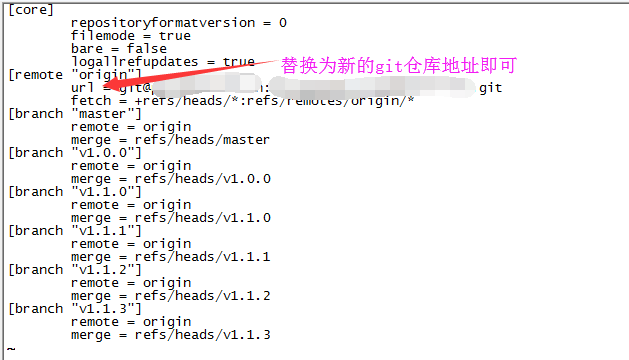

# 查看和切换git项目远程仓库地址

## 查看git项目远程仓库地址

### 方法一： 

```bash

git remote -v

```

### 方法二：

查看项目详细的git配置信息：

```bash

git config -l

```

## 切换git项目的远程仓库地址

### 方法一：

```bash

# 更换远程仓库地址，URL为新地址。
git remote set-url origin url

```

### 方式二：

先删除远程仓库地址，然后再添加:

```bash

# 删除现有远程仓库
git remote rm origin

# 添加新远程仓库
git remote add origin url

```

### 方式三：

修改git项目配置文件

进入到项目目录，使用 ` vim .git/config` 命令编辑修改原有git仓库地址即可

如下图：

