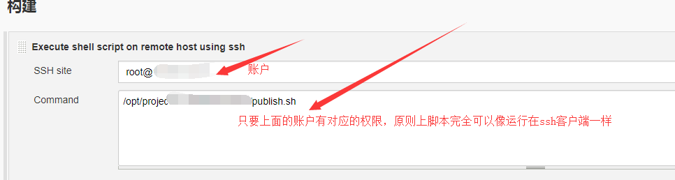

# Jenkins

##  jenkins配置构建脚本

jenkins 工程部署更新远程仓库脚本

```bash

# 进入到工程项目目录
cd /opt/project/projectName/projectName

# 查看项目远程仓库地址
git remote -v

# 切换项目远程仓库地址
git remote set-url origin projectNameGitUrl

# 观察项目远程仓库地址
git remote -v

# 查看远程分支
git fetch

# 检出指定的远程分支
git checkout v1.1.3

# 执行shell脚本
/opt/project/projectName/publish.sh

```

